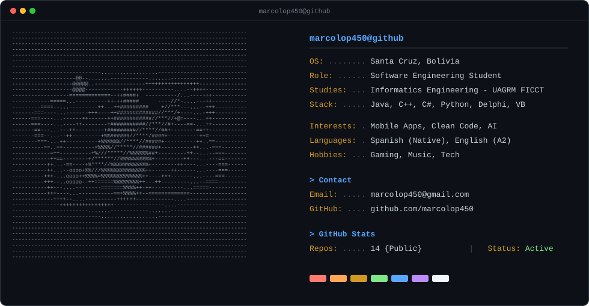

# Marco Alejandro Lopez Velasquez

  

---

### Acerca de mi

- **Estudios:** Estudiante de Ingenieria Informatica en la UAGRM - FICCT (Santa Cruz, Bolivia).
- **Stack:** Java, C++, C#, Python, Delphi, Visual Basic.
- **Areas de interes:** Mobile Apps, Clean Code, Inteligencia Artificial.
- **Idiomas:** Espanol (Nativo), Ingles (A2).
- **Hobbies:** Gaming, Musica, Tecnologia.
- **Contacto:** [marcolop450@gmail.com](mailto:marcolop450@gmail.com) | [GitHub](https://github.com/marcolop450)
